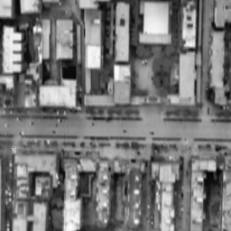

# Progressive Nonuniformity Correction for Aero-optical Thermal Radiation Images via BFBSF

This repository contains the code and data for our paper: 

**Progressive Nonuniformity Correction for Aero-optical Thermal Radiation Images via Bilateral Filtering and Bézier Surface Fitting**

## Abstract
When a high-speed aircraft flies in the atmosphere, the imaging window is subjected to airflow friction, the kinetic energy of the airflow is converted into thermal energy, which makes the surface temperature of the imaging window rise unevenly, the imaging quality is significantly reduced, called aero-optical thermal radiation effects. The continuously increasing nonuniform thermal radiation bias field is not conducive to the precise identification of the target. To remove the bias field in degraded infrared images, this paper proposes a progressive nonuniformity correction method. First, we establish a progressive thermal radiation effects correction model to estimate the thermal radiation bias field based on bilateral filtering and Bézier surface fitting. Then, to avoid overfitting the bias field, the degree of Bézier surface is reduced progressively during the iterative process. Finally, according to the properties of the heat transfer of the aero-optical thermal radiation effects, a gradient orientation prior is imposed for both the thermal radiation bias field and the latent clear image. Experiments on simulated degraded images and real degraded IR images show that our method can reduce the thermal radiation effects residual compared with current aero-optical thermal radiation effects correction methods.


## Requirements
- Matlab R2021 or later
- Image Processing Toolbox (in Matlab)

## RAW set
The BFBSF Algorithm is in the `src/IR_correction.m`, the BFBSF+ code is in the `src/IR_correction_complex.m`. Data of TABLE I in our paper was test on `raw` set.

## MSP set
The Muti-stage Parallel (MSP) version is in the MSP folder. The first run will open the Matlab parallel pool automatically, which may takes a few time.


## Usage
- Run `main.m` to perform progressive nonuniformity correction on an example image.
- The correction function calls `IR_correction.m` which implements our proposed method.
- By changing degraded image floader path `deFloader` and groundtruth image floader path `clFloader` in `main_batch.m`, degraded images can be batch corrected.

Before testing the PSNR and SSIM, the clear image and the correction image should be normlized to the `[0, 1]` interval.

## Results
We provide some results on simulated degraded images and real degraded IR images in `results` folder. Here are some examples:

| Input | Output | Ground truth |
| ----- | ------ | ------ |
|  |  |  |
|  |  |  |
|  |  |  |
|  |  |  |

## Citation
If you find our work useful for your research, please cite our paper:

```bib
@article{BFBSF, 
title={Progressive Nonuniformity Correction for Aero-optical Thermal Radiation Images via Bilateral Filtering and Bézier Surface Fitting}, 
author={},
journal={}, 
year={}
...
}
```

## Contact
If you have any questions or suggestions about our work, please feel free to contact us via email: peko@stu.wit.edu.cn.
